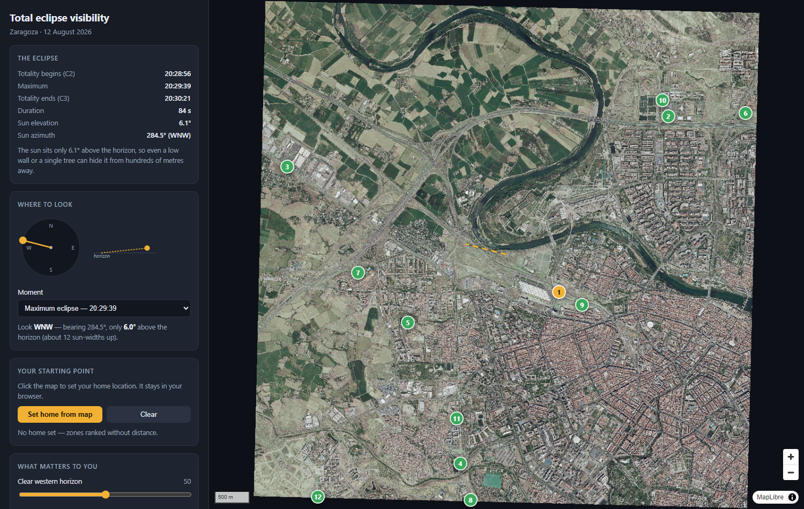
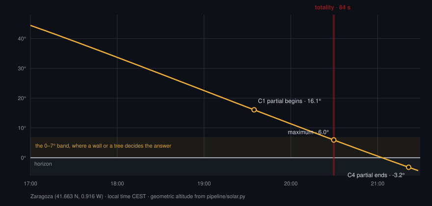
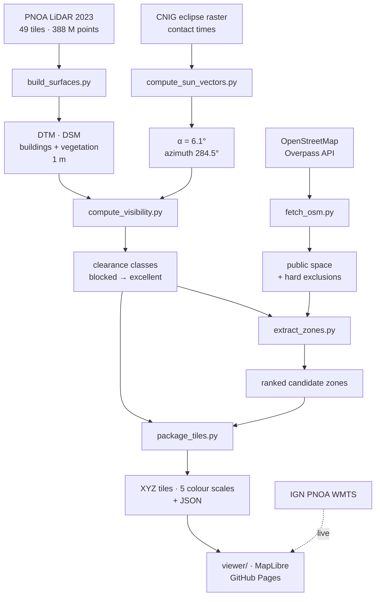
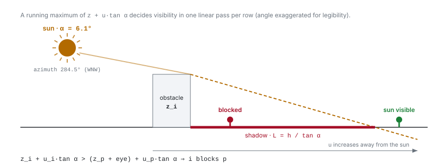

# Zaragoza urban eclipse visibility

Where in Zaragoza can you actually see the total eclipse of 12 August 2026?

At maximum the sun sits only 6.1° above the horizon at azimuth 284.5° (WNW), so a single
tree or a two-storey wall can hide it from hundreds of metres away. Coarse terrain shadow
maps cannot answer this; the question is decided by buildings and vegetation.

This project answers it by ray-scanning a 1 m LiDAR surface model over a 7 × 7 km block of
the city and publishing the result as a static web map over PNOA orthophotography.



## Why this is hard

The eclipse happens as the sun is going down. Totality lasts 84 s and arrives with the sun
barely clear of the rooftops. Everything to the left of the marked band is comfortable
observing, and none of the eclipse happens there.



At 6.1° a 10 m building casts a 94 m shadow. That is why the answer is decided by
individual buildings and trees rather than by terrain, and why the model needs a 1 m
surface rather than a coarse elevation map.

## What is in the box

```
config/zaragoza.yaml    CRS, resolution, eclipse bands, thresholds
pipeline/               offline processing (Python)
tests/                  synthetic + brute-force validation of the shadow scan
viewer/                 MapLibre viewer (Vite), deployed to GitHub Pages
data/output/            generated rasters and JSON (not committed)
```

Live map: https://alfonsolrz.github.io/eclipse-zaragoza-2026/

The viewer's data products under `viewer/public/data/` are committed: the five shadow tile
sets (~106 MB) and the zone/eclipse JSON. Rebuilding them needs the multi-GB LiDAR block,
which is not in the repository, so those committed products are what GitHub Pages serves.

## Pipeline



Run in order, from the repository root, with the virtualenv active:

```bash
python pipeline/inspect_laz.py        # audit: density, classes, footprint
python pipeline/build_surfaces.py     # DTM, building/vegetation/combined DSMs, masks
python pipeline/compute_sun_vectors.py# eclipse geometry and contact times
python pipeline/compute_visibility.py # directional scan -> clearance classes
python pipeline/fetch_osm.py          # OSM land use: public space, exclusions, names
python pipeline/extract_zones.py      # walkable mask, candidate zones, ranking inputs
python pipeline/package_tiles.py      # XYZ tiles (5 colour scales) + JSON
```

`fetch_osm.py` needs network access and hits the public Overpass API, which
rate-limits aggressively; it retries with backoff and degrades gracefully.

`package_tiles.py` takes `--with-rgb` to also render the orthophoto into local tiles. The
deployed viewer does not need them because it reads the IGN WMTS live, but a fully offline
copy does.

Install the pipeline dependencies with `pip install -r requirements.txt`
(developed on Python 3.12).

Then:

```bash
cd viewer && npm install && npm run dev
```

### Where to look

The viewer shows the sun's direction as a compass dial plus a side profile of its altitude,
and draws a 600 m dashed ray on the map from any clicked point or selected zone. That ray
is the line that has to stay clear of buildings and trees. The moment selector switches
between C1, C2, maximum, C3 and C4.

Sun positions come from `pipeline/solar.py` (NOAA algorithm). It agrees with the CNIG
raster's own azimuth at maximum to 0.001°; the ~0.14° elevation difference is atmospheric
refraction, which is deliberately excluded because the shadow scan traces straight rays.
`tests/test_solar.py` pins this agreement, so a regression here cannot silently disagree
with the official product.

### Map layers

The viewer offers five colour scales over the same data: clearance classes, viridis,
red to green, a plain visible/blocked split, and a shadow-only grey. The orthophoto, an
OpenStreetMap name overlay and the dashed analysed-area outline can each be toggled
independently, so the shadow model can be read on its own or against street names.

The overlay covers all evaluated ground (~81% of the block; the rest is building rooftops).
Reachable public space is drawn solid and everything else at 45% opacity, so the shadow
model is legible citywide while the places actually worth standing in still stand out. An
earlier version painted only the walkable 1.6%, which made a working model look broken: a
few coloured patches in an otherwise empty city.

MapLibre has no per-value raster recolouring (`raster-color` is a Mapbox GL property and is
absent even in MapLibre 5.x), so each scale is baked into its own tile set. They cost ~3 MB
each against ~680 MB for the orthophoto, so this is cheaper than it sounds.

Tiles reach zoom 18 (~0.45 m/px at this latitude), close to the native 1 m resolution of
the shadow model.

## How visibility is computed



For a fixed solar elevation `α`, the horizon test is separable, so a full ray trace is
unnecessary. The DSM is resampled onto axes aligned with the solar azimuth, where `u`
increases away from the sun, and each row is scanned once:

```
obstacle i blocks observer p   <=>   z_i + u_i·tan(α) > (z_p + eye) + u_p·tan(α)
```

A running maximum of `z + u·tan(α)` therefore decides visibility in a single linear pass.
Repeating the scan at `α`, `α-0.5°`, `α-1°` and `α-2°` yields angular clearance classes
without per-pixel ray tracing.

> Sign conventions here are treacherous. The tilt is *added*, not subtracted; invalid cells
> must become `-inf` before `np.maximum.accumulate` (NaN propagates along the whole scan
> row); and the rotation basis must keep a single consistent `(row, col)` ordering. Each of
> these was a real bug that silently produced a plausible-looking but wrong map. One of
> them marked 91% of the city as blocked. See `tests/test_visibility_synthetic.py`.

### Validation

```bash
python -m pytest tests/ -q
```

The scan is checked against the analytical shadow length `L = h / tan(α)`, against an
independent brute-force ray march that shares no code path, and for correct shadow
direction at six azimuths. On real data, the mean displacement from buildings to the cells
they shadow matches the solar azimuth with cosine similarity 0.978 over 842k cells.

Solar position is checked against the CNIG raster, against the sun being due south at
local solar noon, and for a monotonically increasing azimuth through the day. The noon
test exists because the usual `acos` azimuth formula needs a hemisphere test to recover
the quadrant, and getting it backwards puts the sun due north at midday while still
producing a plausible-looking elevation.

Note: FFT cross-correlation of the building mask against the blocked mask does *not* work
as a direction check. Shadows overlap their own buildings, so it always peaks at zero lag.

## Clearance classes

| Class | Clearance | Meaning |
|---|---|---|
| blocked | < 0° | the sun is behind an obstacle |
| fragile | 0 to 0.5° | visible, but a small error changes the answer |
| acceptable | 0.5 to 1° | visible |
| good | 1 to 2° | comfortable margin |
| excellent | > 2° | robust |

Zones report the 10th percentile clearance rather than the strict minimum: over thousands
of cells the minimum is set by a single edge pixel clipped by a wall, which collapses
nearly every zone into the same class.

## Coverage and the analysed area

The PNOA orthophoto mosaic (664.5 to 692.9 km E) is far larger than the LiDAR block
(670 to 677 km E, 4611 to 4618 km N), so imagery alone says nothing about where the
analysis holds.

The offline pipeline handles this by masking RGB to the LiDAR footprint, verified at
49.0 km² of opaque imagery against a 49 km² block. Those masked tiles come to 671 MB, 86%
of the whole site, which is too much for a git repository. The deployed viewer therefore
pulls the same PNOA Máxima Actualidad mosaic live from the
[IGN WMTS](https://www.ign.es/wmts/pnoa-ma) and draws the LiDAR footprint as a dashed
outline. Imagery continues past the block, so that dashed edge is what marks where
visibility was computed. Outside it the picture is real but nothing has been analysed.

The WMTS serves current imagery, which may be newer than the 2025-07-14 mosaic the offline
analysis was run against.

## Known limitations

- Walkability combines LiDAR geometry with OSM land use. An earlier version used LiDAR
  alone and recommended motorway verges, farm plots and the surface of the Ebro, all
  genuinely flat, open and unobstructed. Two lessons held: distance to the *nearest*
  building is a bad urbanity proxy (use local building *density*), and water reads as
  ideal ground because it returns almost no LiDAR points. OSM now supplies the positive
  space (parks, squares, gardens, pitches, pedestrian areas, car parks) and the hard
  exclusions (water, motorways, railways, industrial, military, farmland). OSM is
  maintained by volunteers and is not authoritative on public access, so check before
  relying on a spot.
- Car parks are included but down-weighted. They are open and usually accessible, yet a
  supermarket apron is a worse recommendation than a garden of equal clearance. The UI
  exposes both a preference slider and a hard filter.
- Vegetation uses the conservative model (canopy widened by ~2 m and raised by 1 m). Trees
  grow, get pruned and get felled; the LiDAR is from 2023 and the imagery from 2025.
- Roofs are excluded as observing positions, so the overlay leaves them unpainted even
  though they are sunlit. The shadow-only scale is the exception: it shows the physical
  shadow everywhere, roofs included.
- Facades are under-sampled by airborne LiDAR, so building footprints are dilated by 1 m
  to compensate.
- Temporary obstacles (cranes, stages, marquees, parked lorries) are not modelled.
- Totality lasts only 84 s, and the sun moves less than 0.1° over that span, so a single
  geometry at maximum is used for C2, maximum and C3 alike.

## Deployment

Two GitHub Actions workflows:

| Workflow | Trigger | What it does |
|---|---|---|
| `.github/workflows/pages.yml` | push to `main` touching `viewer/**` | `npm ci && npm run build`, checks the data products are in the bundle, publishes to GitHub Pages |
| `.github/workflows/tests.yml` | push to `main`, and every PR | `pytest tests/` on Python 3.12 |

Pages needs one manual step: Settings, then Pages, then Source, then GitHub Actions.

`vite.config.js` sets `base: './'`, so the bundle works from any path and does not need to
know the repository name. Sparse tiles are answered with a real 404 rather than an SPA
fallback. MapLibre reads a 404 as "empty tile", but an HTML body returned with status 200
makes it try to decode markup as a PNG.

`test_matches_cnig_raster_at_maximum` skips in CI by design: it reads a pipeline product
that needs the LiDAR block. The synthetic and analytical checks all run.

## Data sources

- PNOA LiDAR 2023 (NPC02), 49 tiles, ~8 pts/m², 388 M points.
- PNOA Máxima Actualidad orthophotography, mosaic dated 2025-07-14, 0.25 m.
- CNIG eclipse rasters (`10bands_2026_3857_COG.tiff`) for contact times and sun geometry.

Bands 1 to 2 and 6 to 10 of the eclipse raster were cross-checked against the
independently known maximum time; bands 4 to 5 could not be identified and are exposed as
raw values.

The figures in this README are generated by `pipeline/make_diagrams.py` from the same code
they illustrate, so they cannot drift from it.
