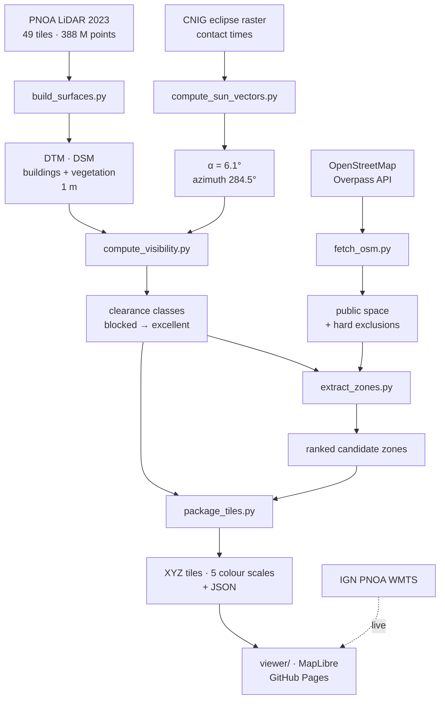

# Usage

Repository layout, the offline pipeline, and how the visibility model is computed,
validated and deployed. For what the map means and how to read it, see
[README.md](README.md).

## What is in the box

```
config/zaragoza.yaml    CRS, resolution, eclipse bands, thresholds
pipeline/               offline processing (Python)
tests/                  synthetic + brute-force validation of the shadow scan
viewer/                 MapLibre viewer (Vite), deployed to GitHub Pages
data/output/            generated rasters and JSON (not committed)
```

The viewer's data products under `viewer/public/data/` are committed: the five shadow tile
sets (~106 MB) and the zone/eclipse JSON. Rebuilding them needs the multi-GB LiDAR block,
which is not in the repository, so those committed products are what GitHub Pages serves.

The raw PNOA LiDAR and orthophoto files are not committed either. They are redistributed
freely by the CNIG; the filenames the pipeline expects are in `config/zaragoza.yaml`.

## Pipeline



Install the dependencies with `pip install -r requirements.txt` (developed on Python 3.12),
then run in order from the repository root with the virtualenv active:

```bash
python pipeline/inspect_laz.py        # audit: density, classes, footprint
python pipeline/build_surfaces.py     # DTM, building/vegetation/combined DSMs, masks
python pipeline/compute_sun_vectors.py# eclipse geometry and contact times
python pipeline/compute_visibility.py # directional scan -> clearance classes
python pipeline/fetch_osm.py          # OSM land use: public space, exclusions, names
python pipeline/extract_zones.py      # walkable mask, candidate zones, ranking inputs
python pipeline/package_tiles.py      # XYZ tiles (5 colour scales) + JSON
```

`fetch_osm.py` needs network access and hits the public Overpass API, which
rate-limits aggressively; it retries with backoff and degrades gracefully.

`package_tiles.py` takes `--with-rgb` to also render the orthophoto into local tiles. The
deployed viewer does not need them because it reads the IGN WMTS live, but a fully offline
copy does. Those tiles come to 671 MB, which is why they are not the default and not
committed.

## 3D terrain (local only)

`package_tiles.py --with-terrain` builds Terrarium-encoded `raster-dem` tiles from
`dsm_all_conservative.tif`, and the viewer grows a "3D terrain" toggle and a vertical
exaggeration slider. Tilt the map and the buildings and trees that decide the answer stand
up as real relief, with the orthophoto and the shadow overlay draped over them.

The DSM is the conservative surface, the one the visibility scan actually ran on, so the
3D view cannot contradict the shadow overlay: anything painted as blocked is blocked by
geometry you can see.

These tiles are **not committed and not deployed**. They are gitignored, and their metadata
goes in `terrain.json` rather than `layers.json` on purpose. `layers.json` is committed and
served in production, so a terrain block there would make the live site advertise tiles that
do not exist and 404 on every one. The viewer loads `terrain.json` with the same optional
try/catch idiom it uses for `osm_labels.json` and removes both controls when it is absent.

Three things about the result are worth knowing before they surprise you:

- Zooms stop at 17. That is 0.89 m/px at this latitude, already finer than the 1 m source,
  so zoom 18 would quadruple the tile count to resample detail that was never measured.
- The DSM has no elevation outside the 7 km block, and MapLibre treats absent DEM coverage
  as sea level. Unmitigated that rings the city with a 200 m cliff, so tiles beyond the
  block ease the nearest edge elevation down to zero over 2 km. Everything outside the
  dashed outline is invented terrain, there so the horizon does not look broken.
- Because the surface includes rooftops and canopy, the orthophoto stretches down building
  walls, and MapLibre's meshing rounds sharp edges. Buildings read as mesas, not boxes.

## Viewer

```bash
cd viewer && npm install && npm run dev
```

`viewer/verify.mjs` drives the running app with Playwright and checks the colour scales,
the layer toggles, the analysed-area outline and the zone ranking. Run it with the dev
server up:

```bash
node verify.mjs <screenshot-dir>
```

It reports console errors and any request that returned 400 or worse, so a broken tile path
or a missing data product shows up as a non-empty `failedRequests` list rather than as a
map that quietly renders nothing.

Sun positions come from `pipeline/solar.py` (NOAA algorithm). It agrees with the CNIG
raster's own azimuth at maximum to 0.001°; the ~0.14° elevation difference is atmospheric
refraction, which is deliberately excluded because the shadow scan traces straight rays.
`tests/test_solar.py` pins this agreement, so a regression here cannot silently disagree
with the official product.

The overlay deliberately covers all evaluated ground rather than only the reachable public
space. An earlier version painted only the walkable 1.6%, which made a working model look
broken: a few coloured patches in an otherwise empty city. Everything else is now drawn at
45% opacity instead of hidden.

MapLibre has no per-value raster recolouring (`raster-color` is a Mapbox GL property and is
absent even in MapLibre 5.x), so each scale is baked into its own tile set. They cost ~3 MB
each against ~680 MB for the orthophoto, so this is cheaper than it sounds.

Tiles reach zoom 18 (~0.45 m/px at this latitude), close to the native 1 m resolution of
the shadow model.

## How visibility is computed


For a fixed solar elevation `α`, the horizon test is separable, so a full ray trace is
unnecessary. The DSM is resampled onto axes aligned with the solar azimuth, where `u`
increases away from the sun, and each row is scanned once:

```
obstacle i blocks observer p   <=>   z_i + u_i·tan(α) > (z_p + eye) + u_p·tan(α)
```

A running maximum of `z + u·tan(α)` therefore decides visibility in a single linear pass.
Repeating the scan at `α`, `α-0.5°`, `α-1°` and `α-2°` yields angular clearance classes
without per-pixel ray tracing.

> Sign conventions here are treacherous. The tilt is *added*, not subtracted; invalid cells
> must become `-inf` before `np.maximum.accumulate` (NaN propagates along the whole scan
> row); and the rotation basis must keep a single consistent `(row, col)` ordering. Each of
> these was a real bug that silently produced a plausible-looking but wrong map. One of
> them marked 91% of the city as blocked. See `tests/test_visibility_synthetic.py`.

## Validation

```bash
python -m pytest tests/ -q
```

The scan is checked against the analytical shadow length `L = h / tan(α)`, against an
independent brute-force ray march that shares no code path, and for correct shadow
direction at six azimuths. On real data, the mean displacement from buildings to the cells
they shadow matches the solar azimuth with cosine similarity 0.978 over 842k cells.

Solar position is checked against the CNIG raster, against the sun being due south at
local solar noon, and for a monotonically increasing azimuth through the day. The noon
test exists because the usual `acos` azimuth formula needs a hemisphere test to recover
the quadrant, and getting it backwards puts the sun due north at midday while still
producing a plausible-looking elevation.

Note: FFT cross-correlation of the building mask against the blocked mask does *not* work
as a direction check. Shadows overlap their own buildings, so it always peaks at zero lag.

## Deployment

Two GitHub Actions workflows:

| Workflow | Trigger | What it does |
|---|---|---|
| `.github/workflows/pages.yml` | push to `main` touching `viewer/**` | `npm ci && npm run build`, checks the data products are in the bundle, publishes to GitHub Pages |
| `.github/workflows/tests.yml` | push to `main`, and every PR | `pytest tests/` on Python 3.12 |

Pages is served from the Actions workflow, set under Settings, then Pages, then Source.

`pages.yml` only fires for changes under `viewer/`, so edits to the docs or the pipeline do
not trigger a redeploy. Use the workflow's manual run to rebuild the site from current
`main` when you want to.

`vite.config.js` sets `base: './'`, so the bundle works from any path and does not need to
know the repository name. Sparse tiles are answered with a real 404 rather than an SPA
fallback. MapLibre reads a 404 as "empty tile", but an HTML body returned with status 200
makes it try to decode markup as a PNG.

`test_matches_cnig_raster_at_maximum` skips in CI by design: it reads a pipeline product
that needs the LiDAR block. The synthetic and analytical checks all run.

## Figures

`pipeline/make_diagrams.py` regenerates `docs/sun-altitude.svg` and
`docs/shadow-geometry.svg` from the same code they illustrate, so they cannot drift from
it. The sun track comes from `solar.py` and the contact times from the CNIG raster metadata
when `data/output/eclipse_metadata.json` exists, falling back to pinned values when it does
not.
